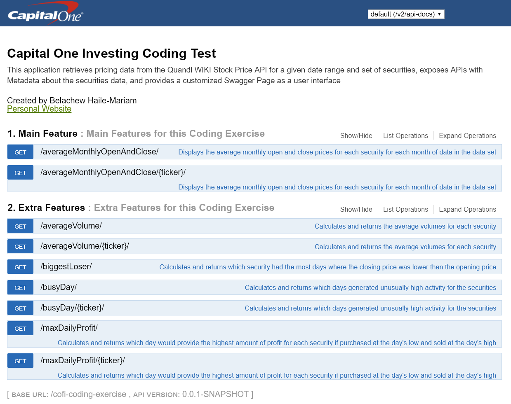

# COFI Coding Exercise

* [Summary](#summary)
* [Tech-Stack](#tech-stack)
* [Build](#build)
* [Run](#run)
* [Swagger Page](#swagger-page)
* [Troubleshooting](#troubleshooting)
* [Contributors](#contributors)

## Summary

This application retrieves pricing data from the Quandl WIKI Stock Price API for a set of securities (COF, GOOGL, MSFT) and given date range (January 1st, 2017 to June 30th, 2017). The application exposes the following APIs that, when triggered, will perform calculations on the data set.
  
<table border="1" style="border: 1px solid #1C6EA4;background-color: #EEEEEE;width: 100%;border-collapse: collapse;text-align: center;">
	<tbody>
		<tr>
			<th>Calculation</th>
			<th>API</th>
			<th>Description</th>
		</tr>
		<tr style="background: #D0E4F5;">
			<td style="padding: 10px;font-weight:bold;">Average Monthly Open and Close</td>
			<td style="padding: 10px;">{base_url}:8080/cofi-coding-exercise/<b>averageMonthlyOpenAndClose</b></td>
			<td style="padding: 10px;">Calculates the average monthly open and close prices for each security for each month of data in the data set</td>
		</tr>
		<tr>
			<td style="padding: 10px;font-weight:bold;">Average Volume</td>
			<td style="padding: 10px;">{base_url}:8080/cofi-coding-exercise/<b>averageVolume</b></td>
			<td style="padding: 10px;">Calculates and returns the average volumes for each security</td>
		</tr>
		<tr style="background: #D0E4F5;">
			<td style="padding: 10px;font-weight:bold;">Biggest Loser</td>
			<td style="padding: 10px;">{base_url}:8080/cofi-coding-exercise/<b>biggestLoser</b></td>
			<td style="padding: 10px;">Calculates and returns which security had the most days where the closing price was lower than the opening price</td>
		</tr>
		<tr>
			<td style="padding: 10px;font-weight:bold;">Busy Day</td>
			<td style="padding: 10px;">{base_url}:8080/cofi-coding-exercise/<b>busyDay</b></td>
			<td style="padding: 10px;">Calculates and returns which days generated unusually high activity for the securities</td>
		</tr>
		<tr style="background: #D0E4F5;">
			<td style="padding: 10px;font-weight:bold;">Max Daily Profit</td>
			<td style="padding: 10px;">{base_url}:8080/cofi-coding-exercise/<b>maxDailyProfit</b></td>
			<td style="padding: 10px;">Calculates and returns which day would provide the highest amount of profit for each security if purchased at the day's low and sold at the day's high</td>
		</tr>
	</tbody>
</table>  

This application also generates a customized Swagger Page that serves as a user interface for the above APIs.

## Tech Stack

	
	
	
	
	<!--  -->
	

## Build

In order to build this application, you must have JDK8 (1.8.0_111 or greater) and Maven (3.3.9 or greater) installed onto your machine. The following are maven build goals that, when invoked from the project's root folder, will build the application.

**Delete the target folder**

	mvn clean
	
**Validate the project is correct and all necessary information is available**

	mvn validate

**Compile the source code of the project into a target folder**

	mvn clean compile
	
**Test the compiled source code using a testing framework**

	mvn clean test

**Take the compiled code and package it in its distributable format, such as a JAR**

	mvn clean package

**Run any checks on results of integration tests to ensure quality criteria are met**

	mvn clean verify

**Install the package into the local repository, for use as a dependency in other projects locally**

	mvn clean install

## Run

Build the project, navigate to the target folder (or wherever the runnable jar file is located), and use the following command:

	java -jar cofi-coding-exercise.jar
	
OR

From the root folder, use the following command:

	mvn spring-boot:run

**Note:** Using the "mvn spring-boot:run" command above does not require a project build, and is generally the preferred way of running the application.

## Troubleshooting

This application connects to the Quandl WIKI Stock Price API to retrieve data. Connection to this API may be blocked from some firewalled networks (such as a work or school network). If you experience any issues connecting to the API, try to switch onto a different network and try again.

## Swagger Page

Once the application is up and running, you can view the swagger page by navigating to the following link in your browser window:

	http://localhost:8080/cofi-coding-exercise/swagger-ui.html#/

## Contributors

* [Belachew Haile-Mariam](http://www.github.com/belachewhm)